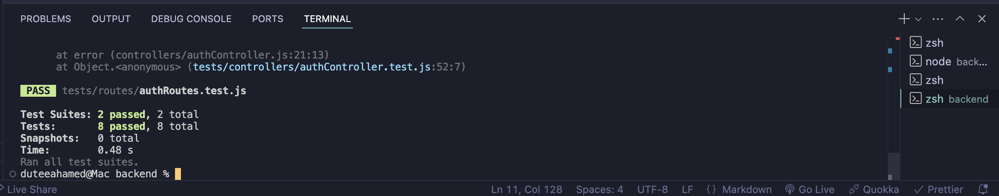

# scratchProj

## Notes (Nisha)

The route logic for the endpoints are incomplete at this time, so I’ve implemented mock/dummy tests using Jest to simulate functionality and ensure routes are properly tested. Tests are located in the backend -> tests directory.

## Misc. Notes, Not Vital (Nisha)

Had to switch port to 5001, was getting constant EADDRINUSE errors on nodemon w/ 5000. Tried the kill -9 process multiple times with no luck.

^Screenshot of Terminal response.

## References:

[FreeCodeCamp] (https://www.youtube.com/watch?v=IPiUDhwnZxA)
[Swashbuckling-with-Code] (https://www.youtube.com/watch?v=gA-uNj2FgdM&t=437s)
[CodeCademy] (https://www.codecademy.com/learn/learn-react-testing/modules/jest/cheatsheet)
[LambdaTest] (https://www.lambdatest.com/jest)
[StackOverflow] (https://stackoverflow.com/questions/57654850/express-mounting-routes)
